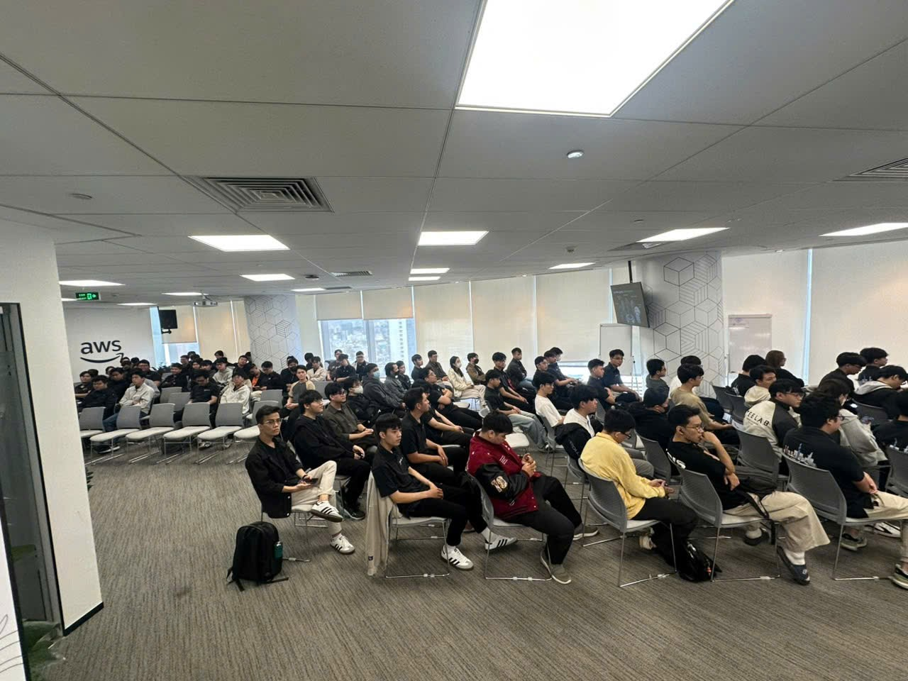
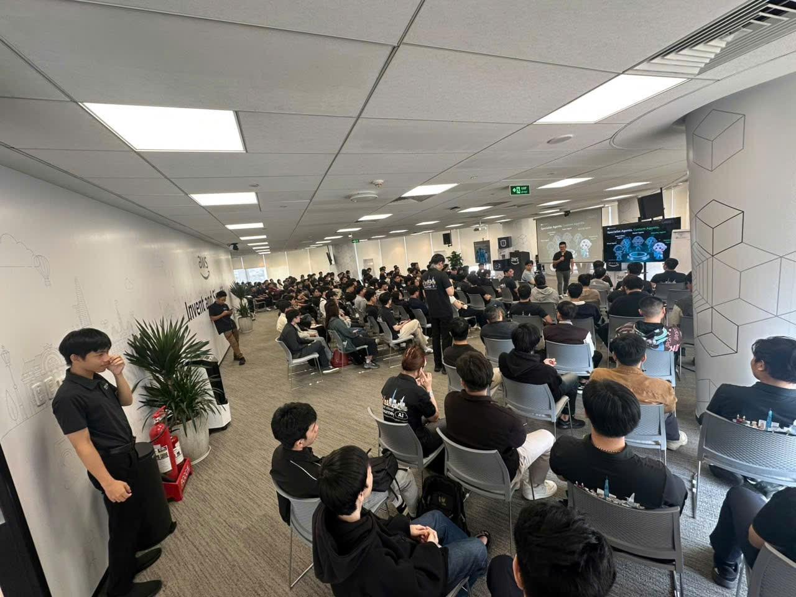

{}
⚠️ **Lưu ý:** Các thông tin dưới đây chỉ nhằm mục đích tham khảo, vui lòng **không sao chép nguyên văn** cho bài báo cáo của bạn kể cả warning này.
{}

# Bài thu hoạch "FCAJ Community Day - June 2026"

Sự kiện **FCAJ Community Day - June 2026** là một buổi hội thảo chuyên sâu dành cho cộng đồng công nghệ, tập trung vào việc cập nhật các xu hướng **AI (trí tuệ nhân tạo)** và **Cloud (điện toán đám mây)** trong môi trường thực tế tại Việt Nam.

### 1. Mục đích của sự kiện

Sự kiện nhằm tạo không gian giao lưu, kết nối giữa các chuyên gia công nghệ và cộng đồng người dùng AWS tại Việt Nam, đồng thời chia sẻ các giải pháp thực tế để ứng dụng AI và Cloud vào vận hành doanh nghiệp.

### 2. Danh sách diễn giả tiêu biểu

Sự kiện có sự tham gia của nhiều chuyên gia từ các doanh nghiệp công nghệ hàng đầu:

- **Anh Steve Trần** từ Cloud Thiên Cơ: Chia sẻ về tư duy triển khai giải pháp công nghệ .
- **Anh Hiếu Nghị** từ Renova Cloud, **Anh Trung** từ AWS Study Builder và **Anh Trung Đ** từ R AI: Nhóm diễn giả về chủ đề giọng nói AI (43:39).
- **Chị Bảo** và **Anh Nguyên** từ Cloud Kinetis: Chia sẻ về giải pháp DevOps AI Agent .
- **Anh Trường** và **Chị Minh Anh** từ Noventis: Chia sẻ về chủ đề AI và nguồn nhân lực .

### 3. Nội dung nổi bật

#### Voice AI trong môi trường doanh nghiệp 

Phiên thảo luận tập trung vào kiến trúc Voice AI, cách xử lý dữ liệu giọng nói tiếng Việt và giải quyết vấn đề vùng miền trong các dịch vụ chăm sóc khách hàng tự động.

#### DevOps AI Agent 

Nội dung giới thiệu giải pháp tự động hóa xử lý sự cố (incident) thông qua AI, giúp giảm đáng kể thời gian xử lý (MTTR) cho các hệ thống lớn.

#### AI trong Quản trị Nhân sự 

Phiên chia sẻ giới thiệu công cụ Amazon Q để hỗ trợ HR trong việc lọc CV, đánh giá ứng viên và xây dựng quy trình tuyển dụng tự động hóa theo hướng no-code.

### 4. Những gì học được & Ứng dụng công việc

- **Tư duy thực thi:** Học được quy trình từ ý tưởng (POC) đến triển khai thực tế (Production), nhấn mạnh việc kết hợp công cụ AI với bài toán cụ thể của doanh nghiệp .
- **Tối ưu hóa vận hành:** Các kỹ sư có thể áp dụng DevOps AI Agent để giảm tải công việc giám sát hệ thống 24/7 và xử lý incident nhanh chóng hơn .
- **Tăng hiệu suất phòng ban:** Đối với khối phi kỹ thuật như HR, có thể tận dụng Amazon Q để tiết kiệm thời gian lọc hồ sơ thủ công và tránh sai sót do cảm tính .

### 5. Trải nghiệm trong event

Sự kiện tạo môi trường tương tác cao thông qua các phiên hỏi đáp (Q&A) giữa diễn giả và khán giả. Người tham dự không chỉ nghe lý thuyết mà còn được tiếp cận với các demo trực tiếp, các workshop thực hành và cơ hội nhận ưu đãi trải nghiệm công cụ, chẳng hạn như 2 tháng dùng thử Dev AI Agent.

Điểm nổi bật của sự kiện là thông điệp rằng **AI không thay thế con người**, mà là công cụ khuếch đại kỹ năng, giúp con người tập trung nhiều hơn vào các quyết định chiến lược.

#### Một số hình ảnh khi tham gia sự kiện

*
*
